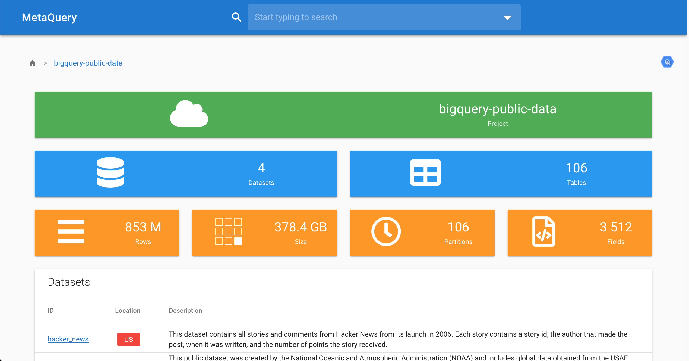

# metaquery

An API to analyze BigQuery metadata

[](https://opensource.org/licenses/Apache-2.0)
[](https://github.com/pcorbel/metaquery/releases)
[](https://godoc.org/github.com/pcorbel/metaquery)


*The WebUI*

--- 

# How to setup

```
docker-compose --file deployments/docker-compose.yaml up
```

Then go to [localhost:8080](http://localhost:8080)

---

# How to edit settings

They are three files to add your own configuration to the project:

* The [deployments/docker-compose.yaml](https://github.com/pcorbel/metaquery/blob/master/deployments/docker-compose.yaml) to configure docker
* The [configs/config.yaml](https://github.com/pcorbel/metaquery/blob/master/configs/config.yaml) to change server/DB settings

--- 

## Project Architecture

## Backend

### Description

The backend is based on Golang to:
* Scrap data from API and BigQuery 
* Compute stats locally based on scraped data
* The [echo library](https://github.com/labstack/echo) to serve as API endpoint and to serve the frontend website

### Dependencies Management

To manage dependencies, we use [go modules](https://github.com/golang/go/wiki/Modules)

To update dependencies, execute:
```go get -u && go mod tidy```

### How to run development mode

To run development mode backend, execute:
```go run *.go```

### How to lint your code

To lint your code, execute:
```go fmt ./...```

### How to build

To build backend, execute:
```go build```

---

# Frontend

## Description

The frontend is based on:
* [vue-material-admin](https://github.com/tookit/vue-material-admin)

### Dependencies Management

To manage dependencies, we use [npm](https://github.com/npm/cli)

To update dependencies, execute:
```npm upgrade --save```

### How to run development mode

To run development mode frontend, execute:
```npm run serve```

### How to lint your code

To lint your code, execute:
```npm run lint```

### How to build

To build frontend, execute:
```npm run build```

---

# Storage

The storage is based on:
* [Postgres](https://github.com/postgres/postgres) to store data
* [gorm](https://github.com/jinzhu/gorm) to serve as an interface between backend and storage
